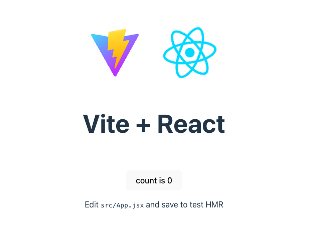

## Objectives

- [ ] Run the project
- [ ] Make a change and see the app update
- [ ] Stop the project

## Steps

### Run the project

1. **Run** _one_ of the following commands:
   #### npm
   ```shell
   npm run dev
   ```
   #### Yarn
   ```shell
   yarn run dev
   ```
2. After the application builds, it will **automatically** **open** your `Chrome` **browser** to [http://localhost:3000](http://localhost:3000).

3. **Verify** the heading **Vite + React** is displayed in the browser.
   

### Make a change and see the app update

1. **Add** some additional text (exclamation points) in the `render` method of the `App` component as shown below.

   #### `src\App.tsx`

   ```diff
   import { useState } from 'react'
   import reactLogo from './assets/react.svg'
   import viteLogo from '/vite.svg'
   import './App.css'

   function App() {
   const [count, setCount] = useState(0)

   return (
      <>
         <div>
         <a href="https://vite.dev" target="_blank">
            
         </a>
         <a href="https://react.dev" target="_blank">
            
         </a>
         </div>
   -     <h1>React + Vite</h1>
   +     <h1>Ready to React</h1>
         <div className="card">
         <button onClick={() => setCount((count) => count + 1)}>
            count is {count}
         </button>
         <p>
            Edit <code>src/App.tsx</code> and save to test HMR
         </p>
         </div>
         <p className="read-the-docs">
         Click on the Vite and React logos to learn more
         </p>
      </>
   )
   }

   export default App
   ```

1. **Save** your changes to the file.
   > In the VS Code menu bar you can turn on `File > Autosave` and this is recommended for the course.
1. **Verify** the new text "Ready to React" is displayed in your browser.

> The page will automatically reload if you make changes to the code. The file saves then the code compiles then the browser refreshes.

### Stop the Project

1. **Focus** your **cursor** in the `command prompt` (Windows) or `terminal` (Mac).
2. **Type** `Ctrl + C`.
   > On `Windows` you will be prompted with `Are you sure you want to... (Y/N)`...type `y`.
3. Use what you learned earlier in the lab to **restart** the application.

---

### &#10004; You have completed Lab 2
